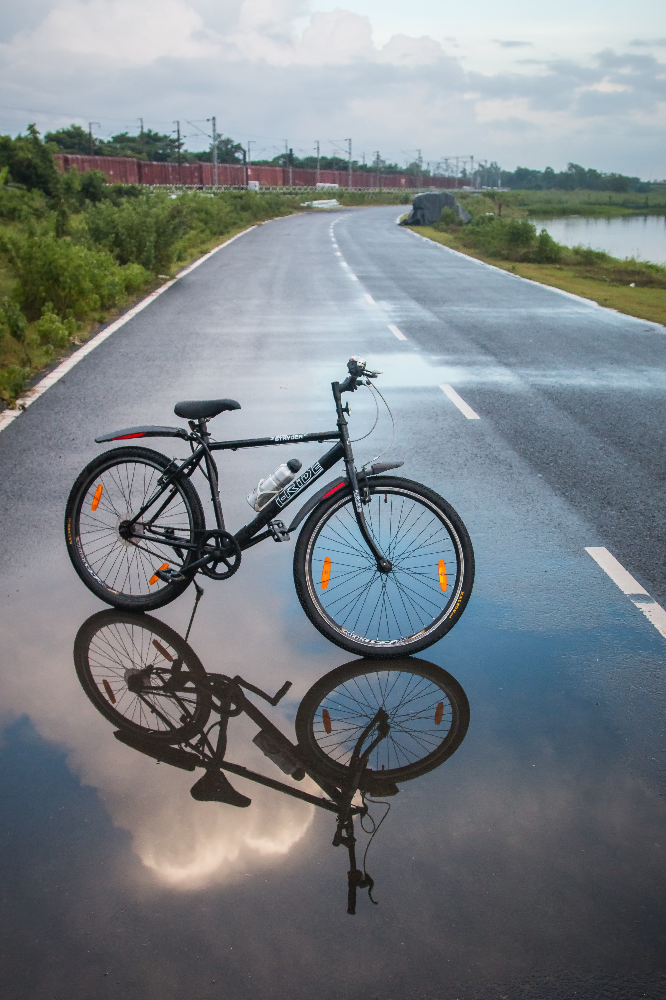
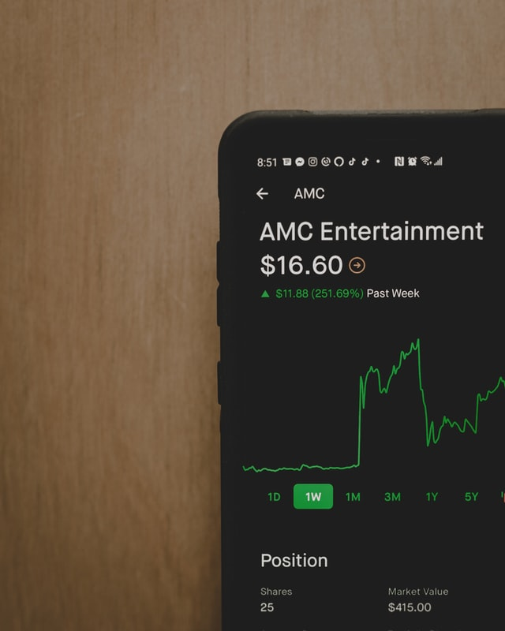

## Pratiwi Eka Puspita

I am a data enthusiast. I love to discover data and find its insight. Here are some of my personal projects related to data analysis. For detail explanation about the project, you may visit my blog at [medium](https://medium.com/@namakutiwik) to read the referred articles. Also, please reach me on [linkedin](https://www.linkedin.com/in/pratiwi-eka-puspita/) to keep connecting.

### [COVID-19 Vaccination Dashboard](https://github.com/namakutiwik/COVID-19-Vaccination/blob/main/Desain%20Dasbor%20Vaksinasi%20COVID-19.pdf)

Photo by on <a href="https://unsplash.com/s/photos/cycle?utm_source=unsplash&utm_medium=referral&utm_content=creditCopyText">Unsplash</a>

I created a design for COVID-19 Dashboard to get a common insight so the public can understand the progress of vaccination. 

* **Skill**     : Visualization
* **Tools**     : Tableau Student
* **Dataset**   : Dummy
* **Output**    : Dashboard

### [New York Citi Bike - Part 2](https://github.com/namakutiwik/New-York-CitiBike/blob/main/png2pdf.pdf)

Photo by <a href="https://unsplash.com/@sav_here?utm_source=unsplash&utm_medium=referral&utm_content=creditCopyText">Saurav Kundu</a> on <a href="https://unsplash.com/s/photos/cycle?utm_source=unsplash&utm_medium=referral&utm_content=creditCopyText">Unsplash</a>
    
I created an interactive dashboard to get a sense of the whole situation and or problem of the New York Citi Bike.
  
* **Skill**     : Data Analysis
* **Tools**     : SQL (BigQuery)
* **Dataset**   : New York Citi Bike
* **Output**    : Exploratory Data Analysis

### [New York Citi Bike - Part 1](https://github.com/namakutiwik/Advanced-SQL)

Photo by <a href="https://unsplash.com/@suspct?utm_source=unsplash&utm_medium=referral&utm_content=creditCopyText">Jordan</a> on <a href="https://unsplash.com/s/photos/citibike?utm_source=unsplash&utm_medium=referral&utm_content=creditCopyText">Unsplash</a>
  
I was trying to write SQL in more advanced style. This project is done to complete the pre-requisite joining DTO family.
  
* **Skill**     : Visualization
* **Tools**     : Tableau Student
* **Dataset**   : New York Citi Bike
* **Output**    : Dashboard

### [Rent Stores](https://github.com/namakutiwik/Dbeaver/blob/master/PracticeCase1.sql)

Photo by <a href="https://unsplash.com/@dmjdenise?utm_source=unsplash&utm_medium=referral&utm_content=creditCopyText">Denise Jans</a> on <a href="https://unsplash.com/s/photos/film?utm_source=unsplash&utm_medium=referral&utm_content=creditCopyText">Unsplash</a>

That moment was incredible when I wrote SQL code for the first time through this project. It is a simple analysis to know the popular film, popular store, loyal customer, and the profit.
  
* **Skill**     : Data Analysis
* **Tools**     : SQL (Dbeaver)
* **Dataset**   : Rental data
* **Output**    : Exploratory Data Analysis

### [Football Player: Prestigious Profession](https://github.com/namakutiwik/Tableau/blob/main/DatVis-Tableau.jpg)

Photo by <a href="https://unsplash.com/@mahdi17?utm_source=unsplash&utm_medium=referral&utm_content=creditCopyText">Md Mahdi</a> on <a href="https://unsplash.com/s/photos/football?utm_source=unsplash&utm_medium=referral&utm_content=creditCopyText">Unsplash</a>

Recently, football is not only an ordinary sport but also becomes an International tournament. The football player is a prestigious profession since it offers a high salary. This project is to find the distribution of wages, age, country, and player's total during the time.

* **Skill**     : Visualization
* **Tools**     : Tableau public
* **Dataset**   : Football player performance
* **Output**    : Dashboard

### [Stock Analysis](https://github.com/namakutiwik/Stocks-with-R/blob/main/Stocks_in_R.ipynb)

Photo by <a href="https://unsplash.com/@claybanks?utm_source=unsplash&utm_medium=referral&utm_content=creditCopyText">Clay Banks</a> on <a href="https://unsplash.com/s/photos/stock-market?utm_source=unsplash&utm_medium=referral&utm_content=creditCopyText">Unsplash</a>

I did this project to evaluate my stock portfolio. I clustered some stocks with a good return and minimum risk to be my recommended stock.
  
* **Skill**     : Machine Learning
* **Tools**     : R (google collab)
* **Dataset**   : Stock (from yahoo finance)
* **Output**    : Stocks Portfolio (clustering)

### [House Price Prediction](https://github.com/namakutiwik/house-price-prediction/blob/master/HousePricePrediction3.ipynb)

Photo by <a href="https://unsplash.com/@withluke?utm_source=unsplash&utm_medium=referral&utm_content=creditCopyText">Luke Stackpoole</a> on <a href="https://unsplash.com/s/photos/house?utm_source=unsplash&utm_medium=referral&utm_content=creditCopyText">Unsplash</a>

This project was a learning path for me to understand machine learning. It predicted the houses based on their features such as location, its environment, and others.
  
* **Skill**     : Machine Learning
* **Tools**     : python (Jupyter Notebook)
* **Dataset**   : House Price (from kaggle)
* **Output**    : Price prediction (linear regression, svm, random forest)

#### [My Website](https://namakutiwik.github.io/Portfolio/)

